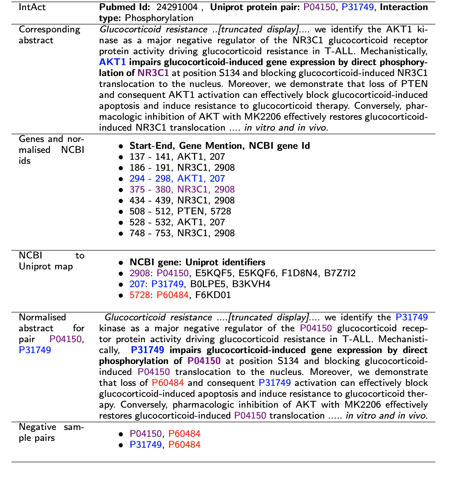

[](https://app.travis-ci.com/elangovana/large-scale-ptm-ppi)

# Large-scale protein-protein post-translational modification extraction with distant supervision and confidence calibrated BioBERT



The silver standard data is
available https://github.com/elangovana/large-scale-ptm-ppi/releases/download/v1.0.0/distant_silver_data.zip

## PTM-PPI Dataset relation extraction

- For data preparation, see https://github.com/elangovana/PPI-typed-relation-extractor
- For training see, [notebooks/ppi_multiclass_sagemaker_bert.ipynb](notebooks/ppi_multiclass_sagemaker_bert.ipynb)
- For large scale prediction,
  see [notebooks/ppi_multiclass_large_scale_prediction.ipynb](notebooks/ppi_multiclass_large_scale_prediction.ipynb)

## AIMed PPI relation extraction

### Download AIMed dataset

1. Download from ftp://ftp.cs.utexas.edu/pub/mooney/bio-data/interactions.tar.gz

2. Convert the raw dataset into XML for using instructions in http://mars.cs.utu.fi/PPICorpora/
      ```bash
      convert_aimed.py -i  aimed_interactions_input_dir -o aimed.xml

      ```

### Run

#### Step 1: Convert xml AIMed to flattened json

```bash
python src/preprocessors/aimed_json_converter.py --inputfile tests/sample_data/aimed.xml --outputfile aimed.json
```

#### Step 2: 10 fold split

You can either choose random split, or split by unique documents

[Option R - Random ] This randomly splits into n folds

   ```bash
   python src/preprocessors/kfold_aimed_json_splitter.py --inputfile aimed.json --outputdir temp_data/kfolds_random  --kfoldLabelColumn interacts --k 10
   ```

[Option U - Unique Document] This splits into n folds, taking into account document id uniqueness

   ```bash
   python src/preprocessors/kfold_aimed_json_splitter.py --inputfile aimed.json --outputdir temp_data/kfolds_unique  --kfoldLabelColumn interacts --k 10  --kfoldDocId documentId
   ```

#### Step 3: Run training

```bash
python src/main_train.py --datasetfactory datasets.aimed_dataset_factory.AimedDatasetFactory --traindir temp_data/kfold_unique --modeldir temp_data --outdir temp_data --kfoldtrainprefix train  --model_config '{"vocab_size": 20000, "hidden_size": 10, "num_hidden_layers": 1, "num_attention_heads": 1, "num_labels": 2}' --tokenisor_data_dir tests/sample_data/tokensior_data --epochs 1 --numworkers 1
```

## Utils

1. To create the preprocessed file with protein names replaced with markers

```bash
python utils/static_markers_ppi_multiclass.py --inputfile temp_data/data/laregscale_hq_above_threshold.json  --outputfile markers_largescale_multiclass.json  --additionalcols "class,confidence"
```

## Chem prot dataset

```bash
python src/preprocessors/chemprot_json_converter.py --abstractfile temp_data/chemprot_test_gs/chemprot_test_abstracts_gs.tsv  --entitiesfile temp_data/chemprot_test_gs/chemprot_test_entities_gs.tsv --relfile temp_data/chemprot_test_gs/chemprot_test_relations_gs.tsv --outputfile chemprot_test.json
``` 

To get preprocessed data with markers for abstract level relation extraction

```bash
python src/utils/static_markers_chemprot_abstract.py --inputfile temp_data/data/chemprot_abstract.json  --outputfile markers_largescale_multiclass.json   --additionalcols "abstract,annotations"
``` 

```bash
python src/utils/static_markers_chemprot_abstract.py --inputfile temp_data/data/chemprot_abstract.json  --outputfile markers_largescale_multiclass.json   --additionalcols "abstract_id,abstract,annotations,prediction,confidence,is_eval,relationship_type,relationship_group,participant1,participant2,participant1_id,participant2_id"

```